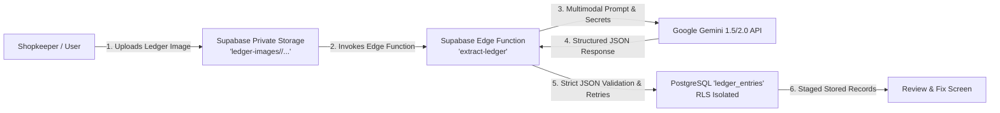

# KhataMatch — AI Ledger & UPI Reconciliation Assistant

> **AI Reconciliation Assistant for Indian shopkeepers, tailors, and freelancers maintaining credit/udhaar in handwritten paper notebooks.**

---

## 🌟 Key Features
1. **Handwritten Ledger Digitisation (Gemini Multimodal AI)**:
   - Extract credit & udhaar records directly from notebook photos (Tamil, English, and Tanglish handwriting).
   - High vs. Low confidence threshold system (≥ 75% auto-flagged for verification).
2. **Deterministic-First Payment Matching**:
   - Matches bank & UPI statement CSV records against credit dues using deterministic rules and fallback AI reasoning.
3. **Respectful Multilingual Reminders**:
   - Polite, friendly, or firm WhatsApp reminders in English, Tamil, and Tanglish.
4. **Human in Control Always**:
   - Zero automated messages. All actions require explicit user review, edit, and click-to-chat approval via WhatsApp (`wa.me`).
5. **Private & Bank-Grade Security**:
   - Row-Level Security (RLS) on all PostgreSQL tables and private storage buckets.
   - Zero frontend exposure of Gemini API keys or service role secrets.

---

## 🏗️ Architecture Workflow (Phase 4)



---

## 🚀 Setup & Local Development

### 1. Prerequisites
- Node.js (v18+)
- Free Supabase Account ([supabase.com](https://supabase.com))
- Free Google AI Studio Gemini API Key ([aistudio.google.com](https://aistudio.google.com))

### 2. Frontend Configuration
Copy the environment variables template:
```bash
cp .env.example .env
```
Fill in your Supabase credentials:
```env
VITE_SUPABASE_URL=https://your-project.supabase.co
VITE_SUPABASE_ANON_KEY=your_supabase_anon_key
```
*(Note: Never add `GEMINI_API_KEY` to frontend `.env`)*

### 3. Install & Run Locally
```bash
npm install
npm run dev
```

---

## 🔒 Supabase Edge Function & Gemini Configuration

### Deploying the Ledger Extraction Function
Deploy the `extract-ledger` function to your Supabase project:
```bash
supabase functions deploy extract-ledger
```

### Configuring Secrets
Set the Gemini API key as a secure secret in Supabase:
```bash
supabase secrets set GEMINI_API_KEY=your_gemini_api_key
supabase secrets set GEMINI_MODEL=gemini-1.5-flash
```

---

## 🧪 Evaluation & Accuracy Testing (Phase 13)

KhataMatch includes a reproducible evaluation framework benchmarked against **25 synthetic test cases** covering difficult handwriting, name variations, duplicate amounts, partial payments, and edge-case disambiguation.

### Running Evaluation
```bash
# Run 25-case evaluation benchmark
npm run eval

# Run formatted evaluation summary
npm run eval:report

# Run all 7 automated unit test suites
npm test
```

### Evaluation Dashboard
Navigate to `/eval` in the application to view live precision, recall, F1 metrics, and inspect test scenarios interactively.

---

## 📄 Database Schema & Storage
The complete PostgreSQL schema, storage buckets, and RLS policies are available in [`supabase/schema.sql`](supabase/schema.sql).
- Tables: `profiles`, `ledger_entries`, `payments`, `matches`, `payment_reminders`.
- Storage: `ledger-images` (Private, scoped to `auth.uid() = (storage.foldername(name))[1]`).
